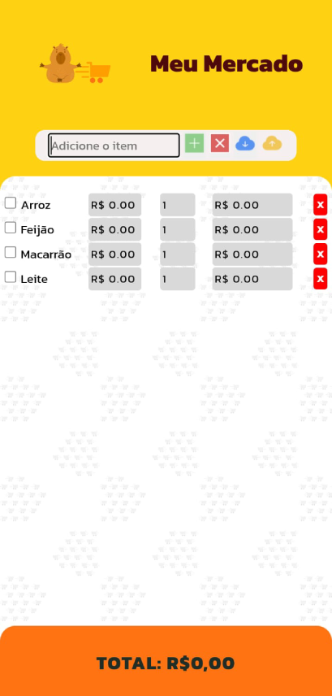
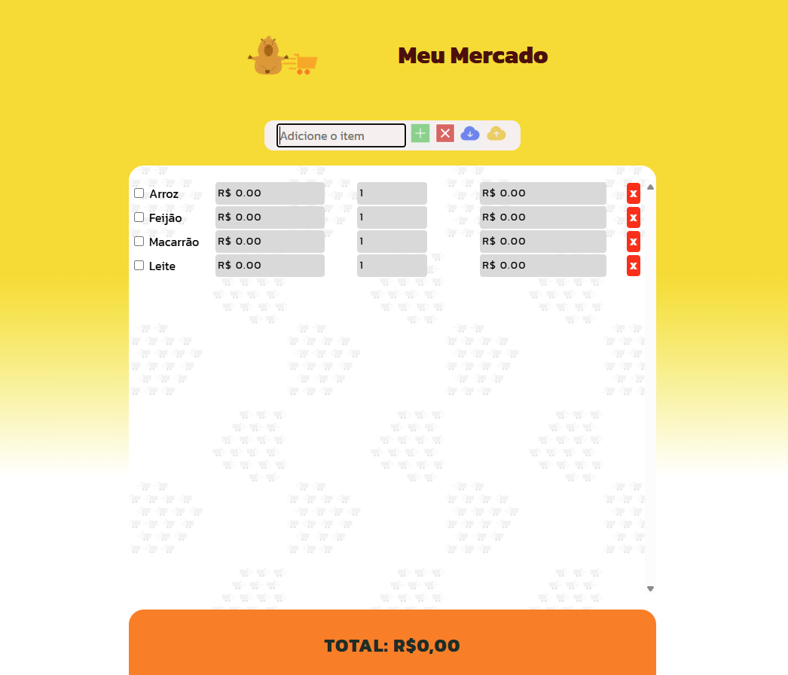

# Meu Mercado®

 Projeto Frontend, com tecnologia simples, porém eficiente. **Meu Mercado** foi criado pela vontade de atender as necessidades diárias de pessoas próximas, mas com a intenção de poder ajudar muitas pessoas na hora de fazer uma lista de itens necessários para a próxima compra do mês ou até mesmo de itens sortidos do dia a dia. A aplicação tem o intuito de colaborar com a organização e o controle dos gastos na hora da compra, pois o usuário consegue incluir o valor unitário de cada item, ver o subtotal deste item se existir quantidade maior que um e ver o total da sua compra.
 
 Para simplificar a aplicação, foi utilizado **Local Storage** do próprio Web Storage API do navegador.

Por que utilizá-lo e quais as vantagens?

 * Permite armazenar informações de forma persistente no dispositivo do usuário;
 * Permite armazenar grandes quantidades de dados;
 * Facilidade da aplicação, dispensa a configuração e o uso de um servidor;
 * Mais acessível, simples e rápido para um projeto pequeno e para o desenvolvedor.

 Os dados armazenados tem suas limitações ao uso, são acessíveis apenas no mesmo domínio. Pensando nisso, foi criado dois botões, o primeiro para fazer o download da lista de compras criada pelo usuário, o segundo, um botão de upload para descarregar uma lista já criada por outro usuário, assim vários usuários conseguem compartilhar uma lista existente.

 
## 🛠 Habilidades Utilizadas

 * Javascript
 * HTML
 * CSS

## Descrição - COMO USAR

 - Tela Inicial / Principal:

    1. O usuário preenche o campo com um item que deseja comprar no supermercado por exemplo, clica no ícone de + (botão verde) na barra superior e assim começa a lista de compras;

    2. Para apagar um único item, o usuário deve clicar no ícone de X (botão vermelho) no lado direito da linha do item adicionado;

    3. De volta para a barra superior, para fazer o download da lista, o usuário deve clicar no ícone de nuvem com uma seta para baixo (botão azul);

    4. Para fazer o upload da lista já baixada no dispositivo, o usuário deve clicar no ícone de nuvem com a seta para cima (botão amarelo);

    5. E para apagar a lista completa, ainda na barra superior, o usuário deve clicar no x (botão vermelho) e confirmar a exclusão da lista.

## Referências

 - [MDN](https://developer.mozilla.org/pt-BR/)
 - [Stackoverflow](https://stackoverflow.com/)
 - [Readme.so](https://readme.so/pt)

## 🚀 Sobre mim
 Sou estudante em: 
  - Desenvolvimento Web Fullstack;
  - Engenharia de Software.
Meu contato no [LinkedIn](https://www.linkedin.com/in/leonardoformaggio/).

## Documentação

 Para saber mais sobre o uso do **Local Storage** acesse:

[Web Storage API](https://developer.mozilla.org/en-US/docs/Web/API/Web_Storage_API)

## Imagem do Projeto

  ### Para Smartphone
  
  ### Para Desktop 
  

